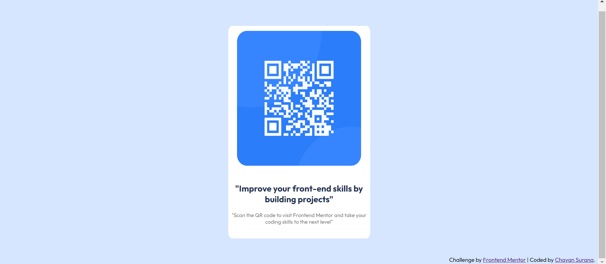

## Table of contents

- [Overview](#overview)
  - [Screenshot](#screenshot)
  - [Links](#links)
- [Built with](#built-with)
- [Author](#author)

## Overview

I have created the QR-code component as shown in the desktop and mobile preview of the problem statement.

  ### Screenshot

  

  ### Links

  - Solution URL: [Add solution URL here](https://your-solution-url.com)

## Built with

- Semantic HTML5 markup
- CSS custom properties

## Author

- Frontend Mentor - [@chayansurana3](https://www.frontendmentor.io/profile/chayansurana3)
- Twitter - [@chayan_surana_](https://twitter.com/chayan_surana_)

